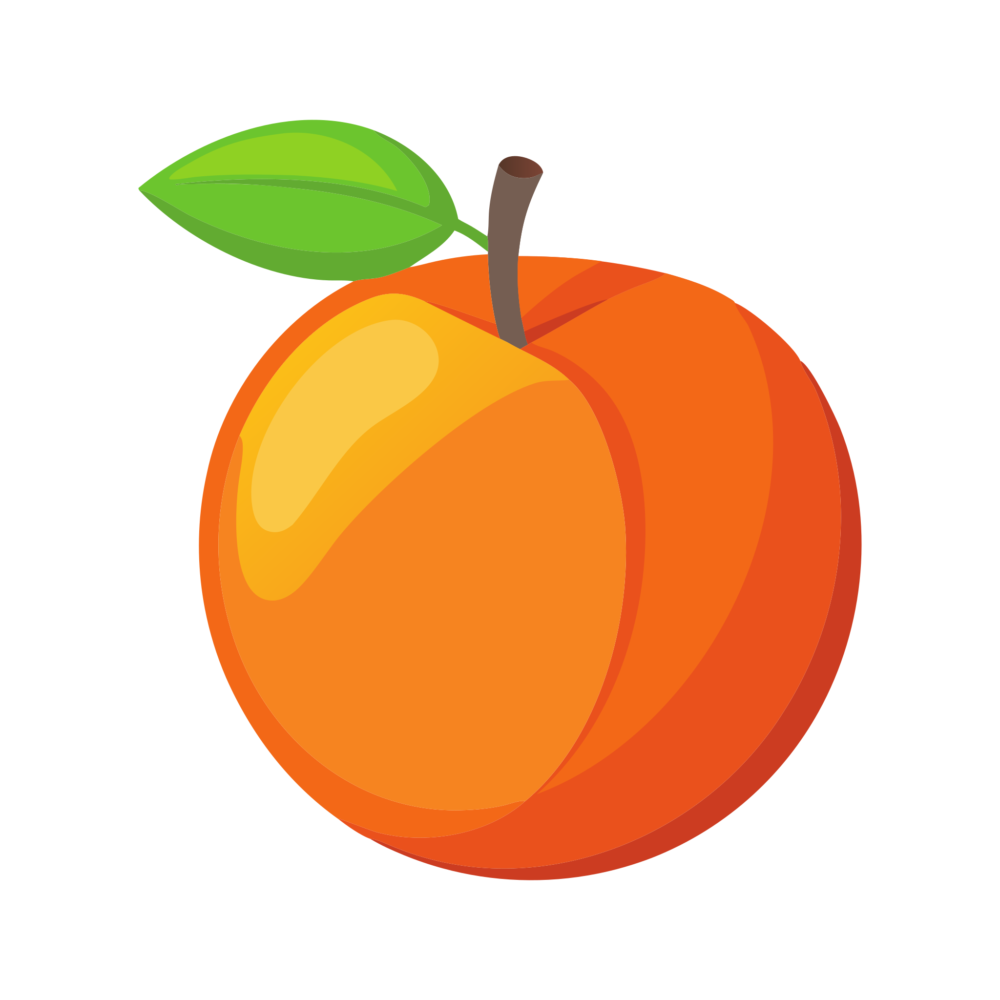
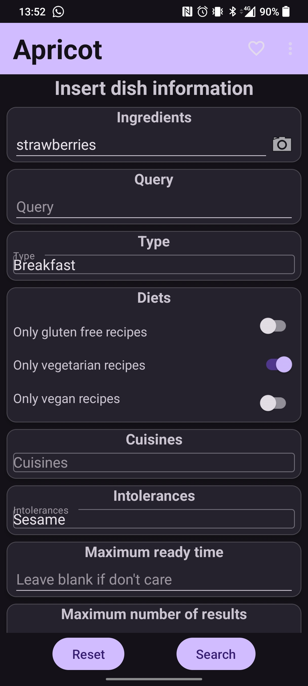
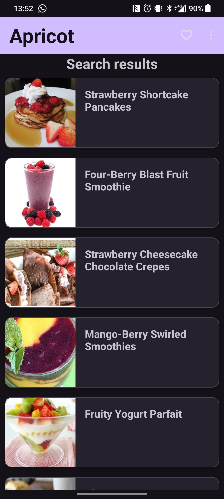
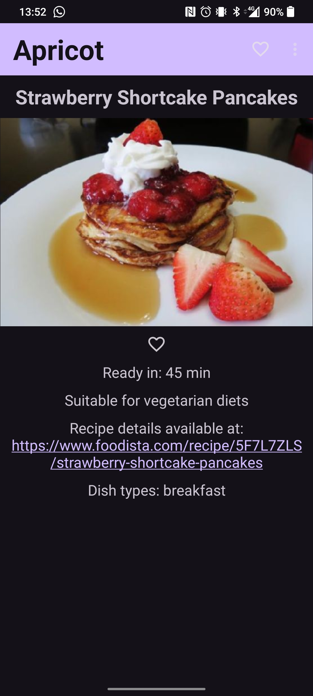
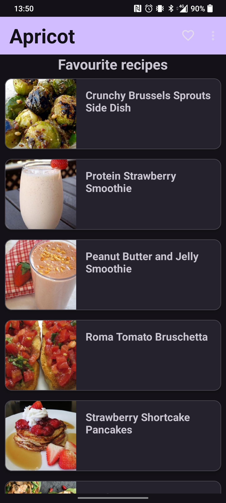
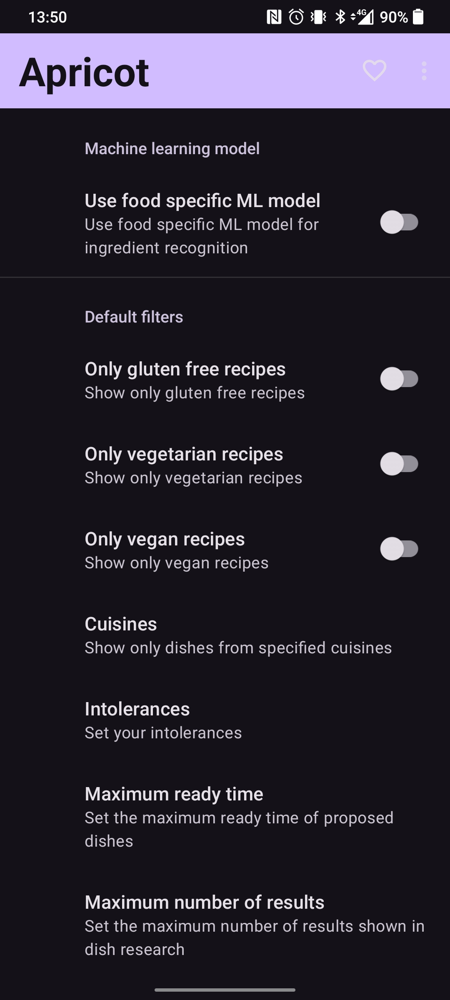

# Apricot
Don't know what to eat? Ask Apricot

    

## Screenshots

 
 

## Future additions

- A prettier UI.

- Translator:  
Possibility to use the app (and ask API) in other languages than english.

- Filter in DisplayResultsFragment and FavouritesFragment:  
The user can change search parameters in that fragments and the recycler view is updated automatically.

- Similar recipes in RecipeDetailsFragment:  
Display similar recipes in that fragment by using Spoonacular specific API.

- More diets as search parameters (whole30, ketogenic, ...)

- Save as favourite from DisplayResultsFragment:  
Add a favourite icon in the recycler view card to allow the user to save the dish as favourite.

## Attributions

App icon: [Vecteezy.com](www.vecteezy.com)